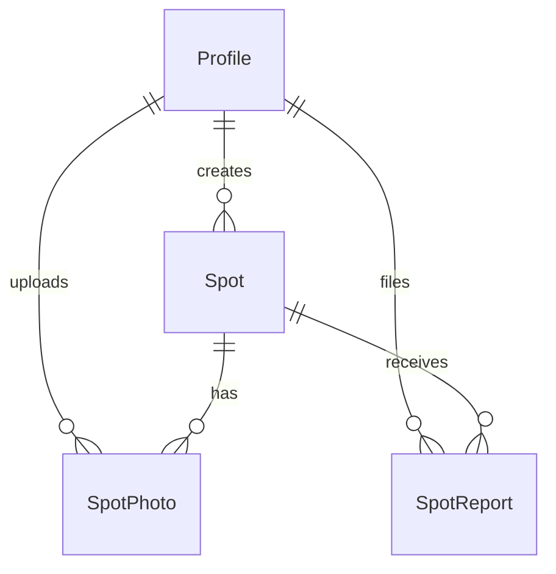

# After the Sun 🌅

[](https://github.com/factor380/after-the-sun/actions/workflows/ci.yml)

**A community map of the best sunset spots in Israel.** Find a spot near you, see today's sunset time there, browse photos from other visitors, and add the places you love.

**Live:** [after-the-sun.vercel.app](https://after-the-sun.vercel.app/) · Hebrew, RTL · Beta (MVP)

---

## Features

- **Interactive map** of sunset spots across Israel (Leaflet + OpenStreetMap), with photo previews in marker popups and a searchable, virtualized spot list.
- **Today's sunset time** for every spot, calculated in the browser from the spot's coordinates, with no API call. Times are shown in `Asia/Jerusalem`.
- **Spot pages** with a community photo gallery and a full-screen lightbox, plus one-tap navigation to the spot.
- **Google sign-in** through Supabase Auth.
- **Add and edit spots**: drop a pin or search for a place, fill a short form, and upload photos (up to 2 when creating a spot). Owners can edit their own spots from **My spots**.
- **Community photos**: any signed-in user can add photos to any spot. The uploader or the spot owner can remove them (max 24 per spot, 5 per user per spot).
- **Reporting**: users can flag a spot for moderation. Reports are reviewed in Prisma Studio for now.
- **Campaign page** (`/about`): a public push toward 50 sunset spots.
- **SEO**: per-page metadata, JSON-LD structured data, dynamic sitemap, robots, and generated Open Graph images. Public routes are `/`, `/about`, and `/spots/[id]`.
- **Light and dark theme**.

## Engineering highlights

- **Offline sunset calculation.** [`src/lib/geo/sunset.ts`](src/lib/geo/sunset.ts) implements the solar position equations (SunCalc / Meeus formulation) in TypeScript. It's accurate to about a minute, refines the estimate in two passes, and caches results by rounded coordinates and date, so the map can show sunset times for every spot without any server requests.
- **Layered API design.** Route handlers in `src/app/api` handle HTTP concerns only. Input is validated with **Zod** schemas in `src/lib/validations`, and data access lives in a separate service layer (`src/services`) on top of **Prisma**.
- **Secure uploads.** The upload route checks that the request comes from the same origin, requires an authenticated user, and is rate limited. It enforces a size cap and **verifies the file's magic bytes** instead of trusting the declared MIME type. Files are stored under the user's own folder, and Supabase Storage **row-level security policies** enforce that folder ownership.
- **Client-side image compression.** Photos are resized and re-encoded as JPEG in the browser before upload ([`src/lib/compress-spot-photo.ts`](src/lib/compress-spot-photo.ts)), which keeps storage and bandwidth inside the free tier.
- **Geo constraints.** Spots are validated to fall inside Israel on the server, and place search goes through a server-side proxy to Geoapify, so the API key never reaches the browser.
- **Zero-cost infrastructure.** Everything runs on free tiers: Vercel Hobby, Supabase Free (Postgres, Auth, Storage), and OpenStreetMap tiles.

## Tech stack

| Layer | Tools |
|-------|-------|
| Frontend | Next.js 16 (App Router), React 19, TypeScript, Tailwind CSS 4 |
| Maps | Leaflet, React Leaflet, OpenStreetMap, Geoapify (place search) |
| Backend | Next.js Route Handlers, Zod, Prisma ORM |
| Data and auth | Supabase (PostgreSQL, Google OAuth, Storage) |
| Hosting | Vercel, Vercel Analytics |

## Data model



## Project structure

```
src/
  app/            Pages and API route handlers (App Router)
    api/          spots, photos, reports, upload, geocode
    about/        Campaign page (goal: 50 spots)
    spots/        Detail, create, edit, and "my spots"
  components/     UI: map, spot list and forms, gallery, header
  lib/
    geo/          sunset calculation, distance, geocoding, Israel bounds
    validations/  Zod schemas
    supabase/     server, client, and middleware helpers
    seo.ts        metadata and JSON-LD builders
    i18n/         Hebrew copy
  services/       Data access layer (Prisma)
prisma/           Schema and seed data
```

## Running locally

1. Create a free [Supabase](https://supabase.com) project.
2. Copy `.env.example` to `.env` and fill in:
   - `NEXT_PUBLIC_SUPABASE_URL` and `NEXT_PUBLIC_SUPABASE_ANON_KEY` (Project Settings → API)
   - `DATABASE_URL` (transaction pooler, port **6543**, with `?pgbouncer=true`)
   - `DIRECT_URL` (session / direct connection, port **5432**)
   - `NEXT_PUBLIC_SITE_URL` (`http://localhost:3004` locally)
   - `GEOAPIFY_API_KEY` (optional; enables place search. Pin dropping works without it)
3. In Supabase, go to Auth → URL Configuration:
   - **Site URL**: your production URL (e.g. `https://after-the-sun.vercel.app`)
   - **Redirect URLs**: include both production *and* local, or Google login from localhost will bounce to the live site:
     - `http://localhost:3004/auth/callback`
     - `http://localhost:3004/**`
     - `https://your-domain/auth/callback`
4. Enable **Google** sign-in:
   - Supabase Dashboard → Authentication → Providers → Google → Enable
   - In [Google Cloud Console](https://console.cloud.google.com/apis/credentials), create an **OAuth 2.0 Client ID** (Web application)
   - Authorized redirect URI: copy it from Supabase (e.g. `https://<project-ref>.supabase.co/auth/v1/callback`)
   - Paste the Client ID and Client Secret into Supabase
5. Create a **public** Storage bucket named `spot-photos`, then run this in the SQL Editor:

```sql
-- Authenticated users upload only into their own folder
create policy "spot photos insert own folder"
on storage.objects for insert to authenticated
with check (
  bucket_id = 'spot-photos'
  and (storage.foldername(name))[1] = auth.uid()::text
);

-- Anyone can read public spot photos
create policy "spot photos public read"
on storage.objects for select to public
using (bucket_id = 'spot-photos');

-- Contributors can remove their own uploads
create policy "spot photos delete own folder"
on storage.objects for delete to authenticated
using (
  bucket_id = 'spot-photos'
  and (storage.foldername(name))[1] = auth.uid()::text
);
```

6. Install, push the schema, seed, and run:

```bash
npm install
npm run db:push
npm run db:seed
npm run dev
```

Open [http://localhost:3004](http://localhost:3004).

### Scripts

| Command | Purpose |
|---------|---------|
| `npm run dev` | Local dev server on port 3004 |
| `npm run build` | Production build |
| `npm run start` | Production server on port 3004 |
| `npm run lint` | ESLint |
| `npm run typecheck` | TypeScript check, no emit |
| `npm test` | Unit tests (Vitest) |
| `npm run db:push` | Sync the Prisma schema to Supabase |
| `npm run db:seed` | Seed 8 sunset spots in Israel |
| `npm run db:studio` | Open Prisma Studio |
| `npm run icons` | Regenerate favicons from the brand mark |

## Roadmap

- [x] CI on every push and pull request (install, lint, typecheck, Vitest)
- [ ] Move rate limiting to a shared store (e.g. Redis), since the in-memory limiter is per serverless instance
- [ ] Moderation dashboard for reports, which are currently reviewed in Prisma Studio
- [ ] AI-powered spot recommendations through a separate `src/ai/` layer on top of the existing services

## Author

Built by **Binyamin Factor**, backend developer. [GitHub](https://github.com/factor380)
